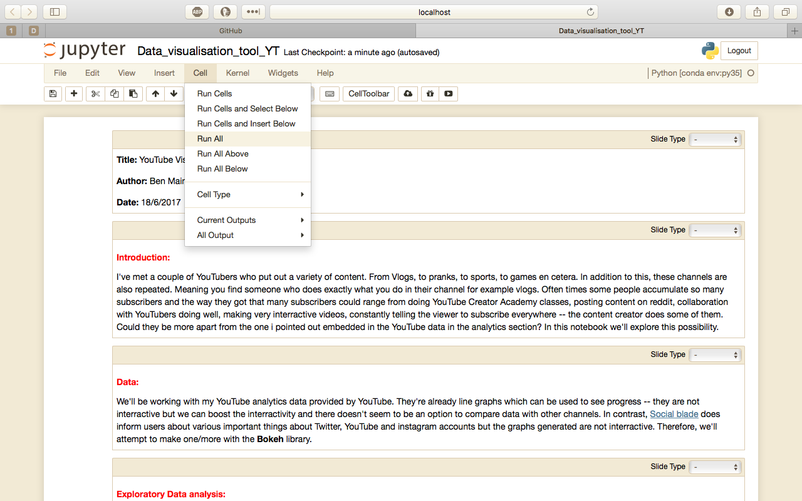
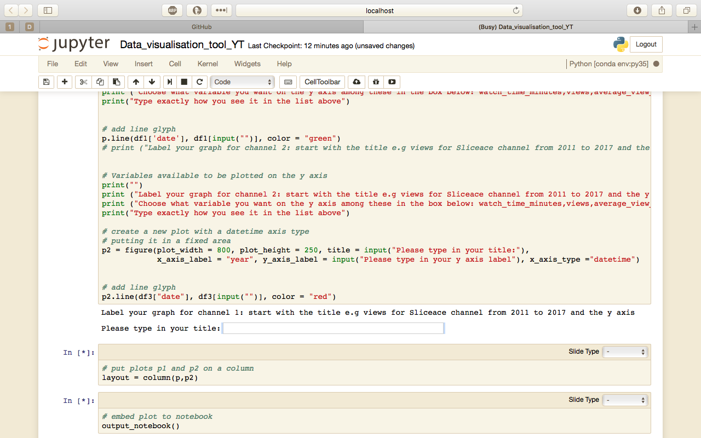
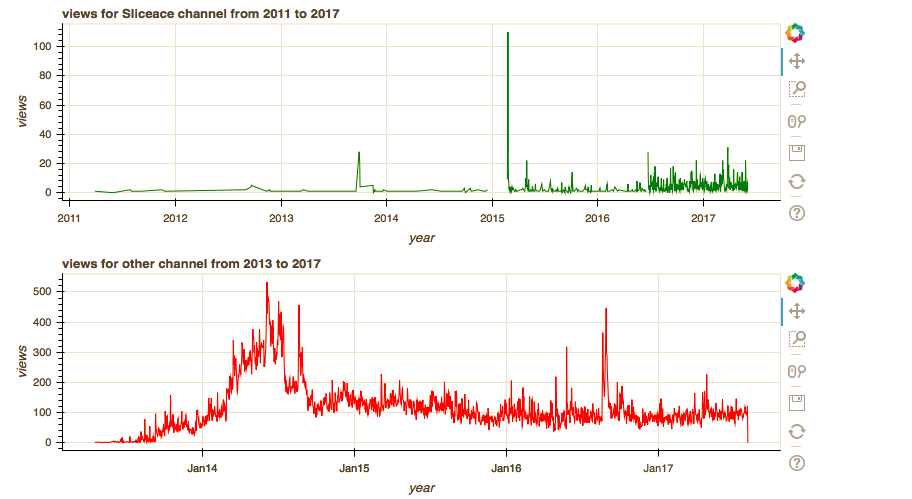

# YT_dataviz
This is a Data visualisation tool, I presented at PyConKE on 28th September 2017 at USIU-Africa. I make use of Jupyter notebooks, Python, Pandas, Bokeh to make a multipurpose data visualisation tool that addresses the limitations i've seen in other alternatives according to the presentation i gave.

You can reach by email or saying Hi! on twitter [@Shuyin_ben](https://twitter.com/Shuyin_ben)

Prerequisites:
* Programming basics and python programming. Familiarity with pandas and Bokeh.
* Know how to use Jupyter notebooks.
* Some knowledge about terminal/shell.
* If you manage to install everything and run jupyter then all you need to do is
change the title and y-axis of the graphs. 

Use this to install dependencies:

`pip install -r requirements.txt`

Then go through the codebook.txt and the slides(PyCon-presentation.odp - Use LibreOffice).
You can use any other software to open the file.

Afterwards, you can start the notebook like this:

`jupyter notebook Data_visualisation_tool_YT.ipynb`

---

All you have to do is run(Run all) the code like demonstrated here:

After running, you'll get a text box pop up. If you have not been taken to this cell scroll down until you see this.
The positioning of the "Please type in your title: textbox changes if you run this a few
times.

Type the following to check if it works in this **ORDER**. If you don't you'll get many errors. For example:

Please type in your title: "views for Sliceace channel from 2011 to 2017" [Press Enter]

Please type in your y axis label "views" [Press Enter]

"views" [Press Enter]

Type what is in quotes in the text box and don't include the **quotes**. If you mess up run
it again and follow the above procedure.

Moreover, you'll be asked the same question for the next channel. Follow the same 
procedure. Except change the title of the graph like this.

Please type in your title: "views for other channel from 2011 to 2017" [Press Enter]

Please type in your y axis label "views" [Press Enter]

"views" [Press Enter]

**Fingers crossed**

This is what you'll get 

You see those icons to the right of the graphs; They do something awesome! Have you tried using
them?

Now try for the subscribers_gained variable. Rerun the code again by clicking "Run All" 
like in the first image.

You know the drill :) 

Please type in your title: "subscribers_gained for Sliceace channel from 2011 to 2017" [Press Enter]

Please type in your y axis label "subscribers_gained" [Press Enter]

"subscribers_gained" [Press Enter]

Try for average_view_duration and the other variables i've mentioned in the codebook.

